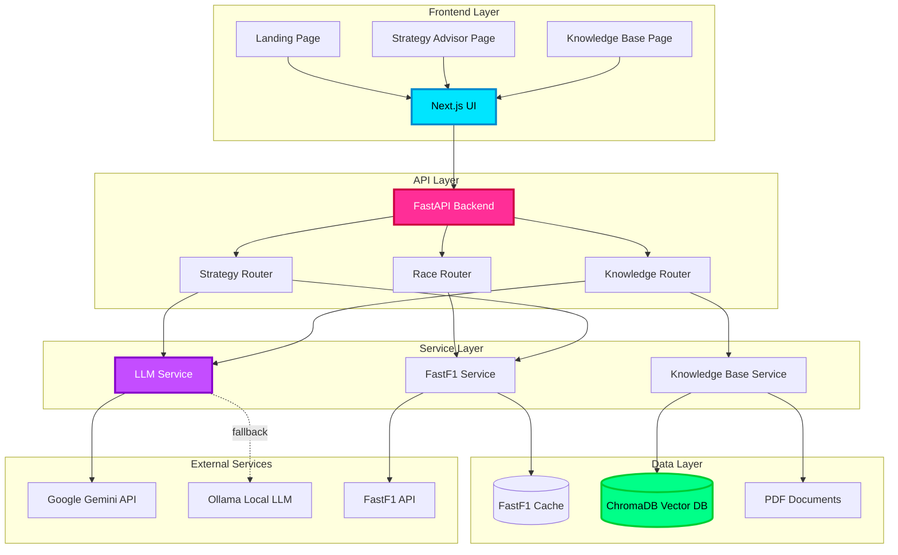
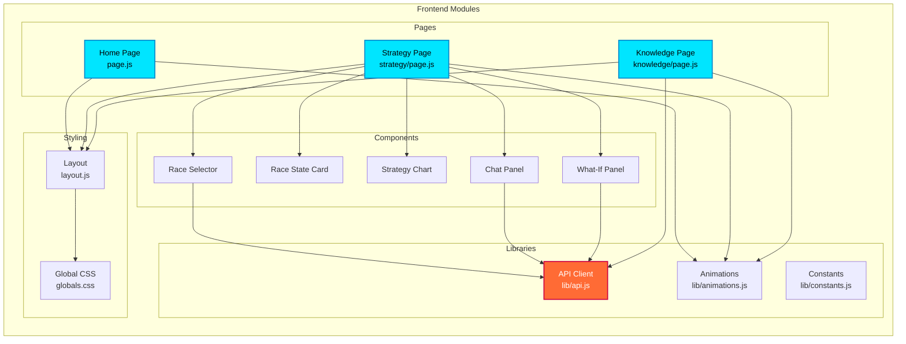
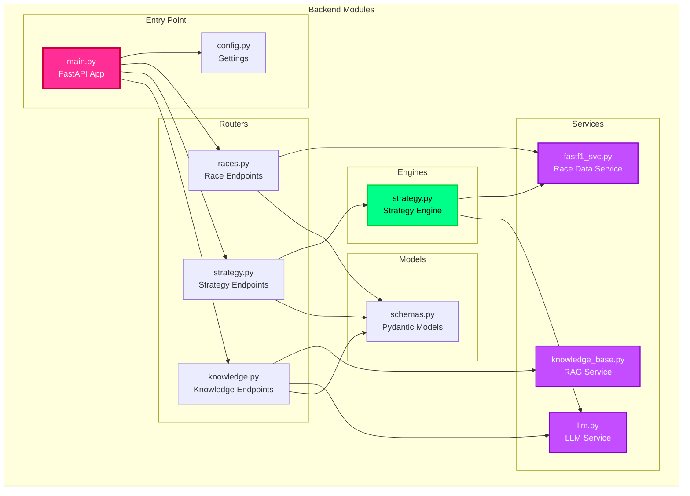
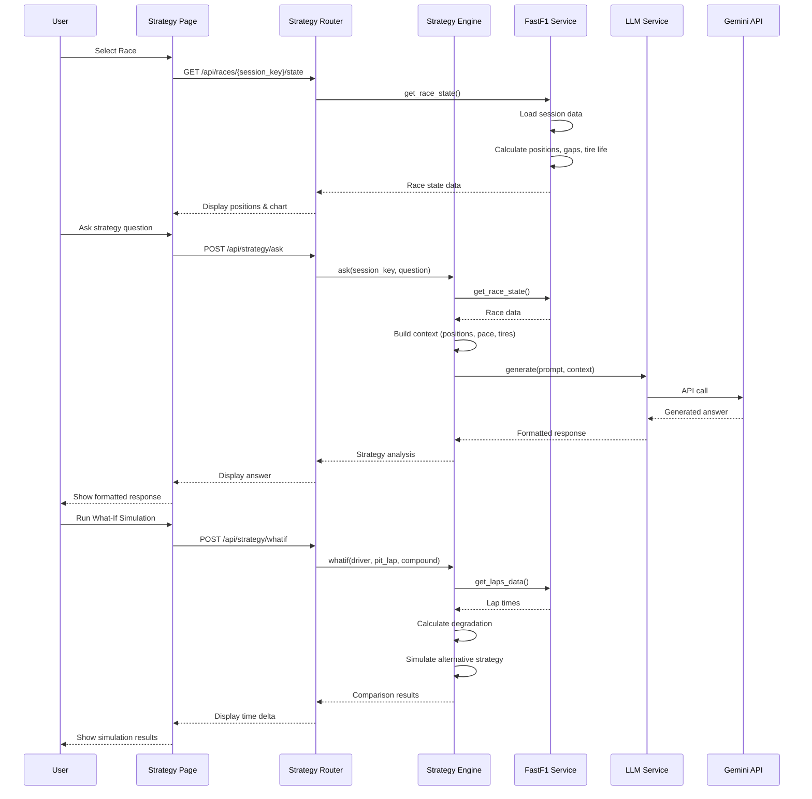
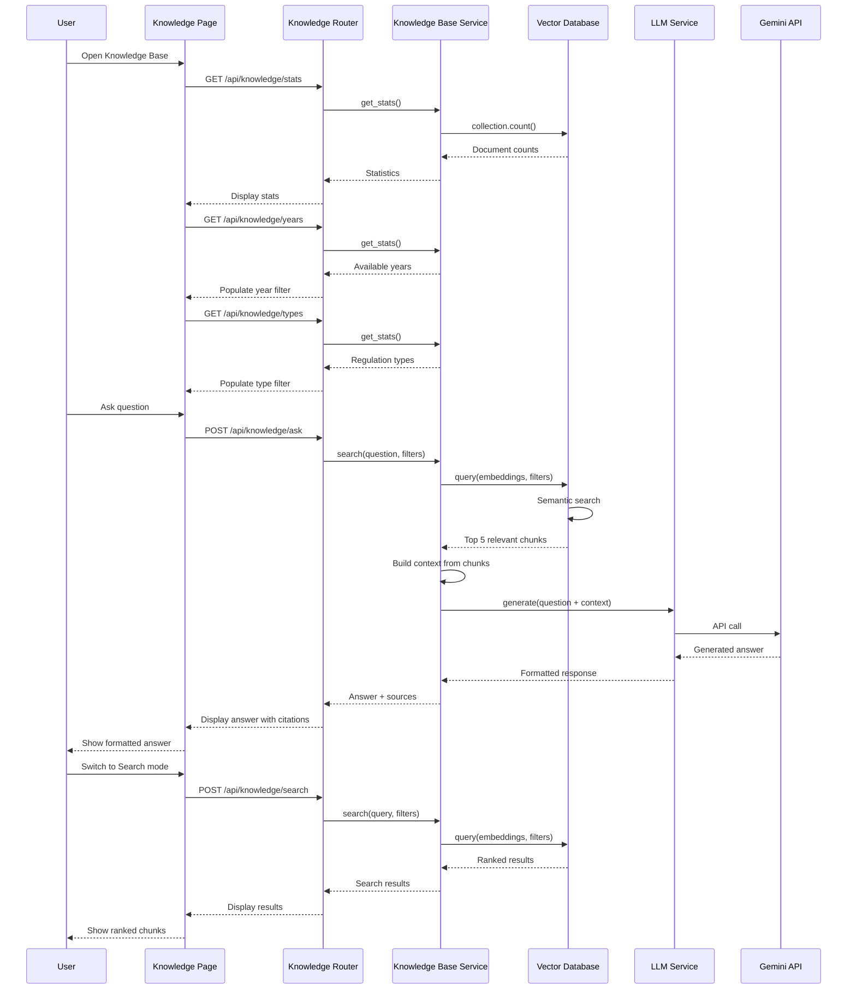
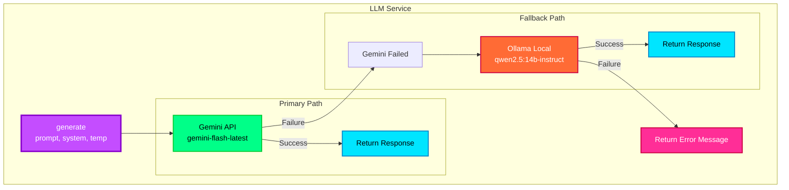
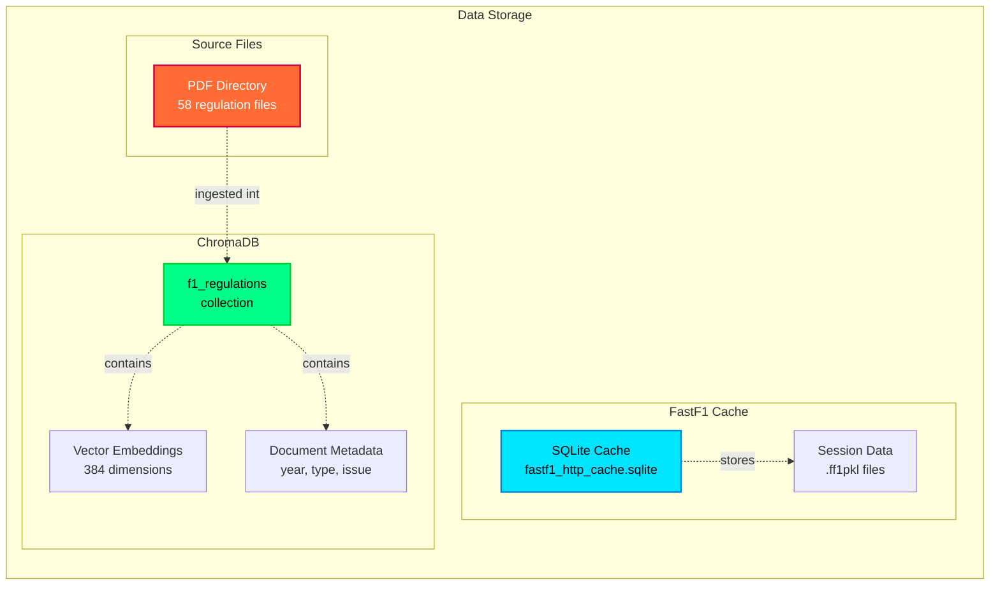
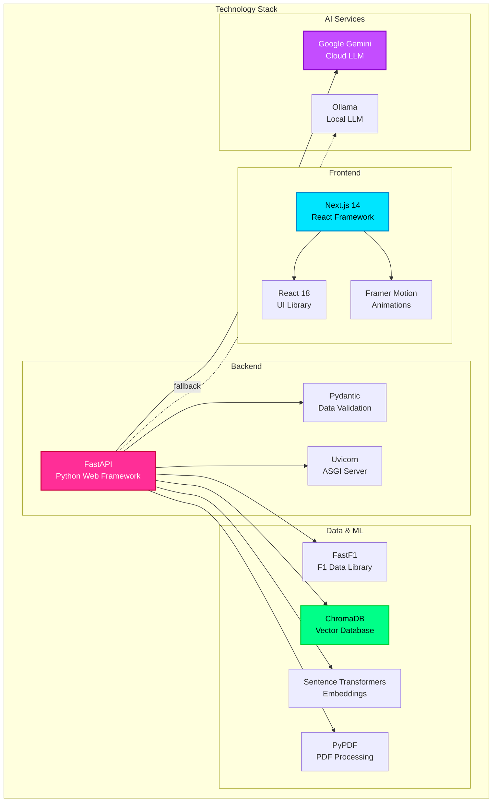
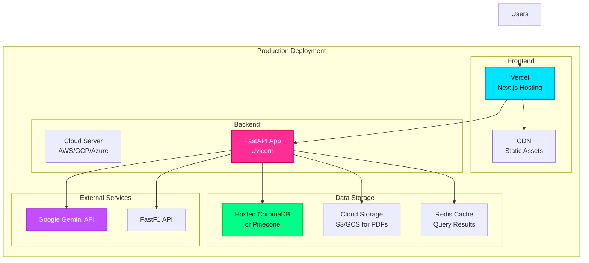

# PitWall AI - System Architecture

## High-Level Architecture



---

## Module-wise Architecture

### 1. Frontend Architecture



---

### 2. Backend Architecture



---

### 3. Strategy Advisor Flow



---

### 4. Knowledge Base Flow



---

### 5. Data Ingestion Flow

```mermaid
graph TB
    subgraph "PDF Ingestion Pipeline"
        PDFs[PDF Files<br/>58 documents]
        Extract[Text Extraction<br/>pypdf]
        Parse[Metadata Parsing<br/>filename analysis]
        Chunk[Text Chunking<br/>1000 chars, 200 overlap]
        Batch[Batch Processing<br/>100 chunks/batch]
        Embed[Embedding Generation<br/>sentence-transformers]
        Store[Vector Storage<br/>ChromaDB]
    end
    
    PDFs --> Extract
    Extract --> Parse
    Parse --> Chunk
    Chunk --> Batch
    Batch --> Embed
    Embed --> Store
    
    Extract -.metadata.-> Parse
    Parse -.year, type, issue.-> Chunk
    Chunk -.27,346 chunks.-> Batch
    Batch -.100 at a time.-> Embed
    Embed -.384-dim vectors.-> Store
    
    style PDFs fill:#ff6b35,stroke:#cc0040,stroke-width:2px,color:#fff
    style Extract fill:#c44dff,stroke:#8800cc,stroke-width:2px,color:#fff
    style Parse fill:#c44dff,stroke:#8800cc,stroke-width:2px,color:#fff
    style Chunk fill:#c44dff,stroke:#8800cc,stroke-width:2px,color:#fff
    style Batch fill:#00ff88,stroke:#00cc33,stroke-width:2px,color:#000
    style Embed fill:#00e5ff,stroke:#0088cc,stroke-width:2px,color:#000
    style Store fill:#00ff88,stroke:#00cc33,stroke-width:2px,color:#000
```



---

### 6. LLM Service Architecture



---

### 7. Data Storage Architecture



---

### 8. API Endpoints Overview

```mermaid
graph TB
    subgraph "API Endpoints"
        subgraph "Race Endpoints"
            GetRaces[GET /api/races<br/>List races by year]
            GetState[GET /api/races/{id}/state<br/>Get race state]
            GetLaps[GET /api/races/{id}/laps<br/>Get lap data]
        end
        
        subgraph "Strategy Endpoints"
            AskStrategy[POST /api/strategy/ask<br/>Ask strategy question]
            WhatIf[POST /api/strategy/whatif<br/>Run simulation]
        end
        
        subgraph "Knowledge Endpoints"
            Search[POST /api/knowledge/search<br/>Semantic search]
            Ask[POST /api/knowledge/ask<br/>RAG Q&A]
            Stats[GET /api/knowledge/stats<br/>Get statistics]
            Years[GET /api/knowledge/years<br/>Get available years]
            Types[GET /api/knowledge/types<br/>Get regulation types]
            Ingest[POST /api/knowledge/ingest<br/>Ingest PDFs]
        end
        
        subgraph "Health"
            Health[GET /health<br/>Health check]
        end
    end
    
    style GetRaces fill:#00e5ff,stroke:#0088cc,stroke-width:2px,color:#000
    style GetState fill:#00e5ff,stroke:#0088cc,stroke-width:2px,color:#000
    style AskStrategy fill:#c44dff,stroke:#8800cc,stroke-width:2px,color:#fff
    style WhatIf fill:#c44dff,stroke:#8800cc,stroke-width:2px,color:#fff
    style Search fill:#00ff88,stroke:#00cc33,stroke-width:2px,color:#000
    style Ask fill:#00ff88,stroke:#00cc33,stroke-width:2px,color:#000
    style Health fill:#ff6b35,stroke:#cc0040,stroke-width:2px,color:#fff
```

---

### 9. Technology Stack



---

## Deployment Architecture



---

## Color Legend

- 🔵 **Cyan** - Frontend components and user-facing elements
- 🔴 **Red/Pink** - Backend API and core services
- 🟣 **Purple** - AI/ML services and LLM components
- 🟢 **Green** - Data storage and databases
- 🟠 **Orange** - External services and fallback systems

---

**Generated**: April 1, 2026  
**Version**: 1.0  
**Format**: Mermaid Diagrams
